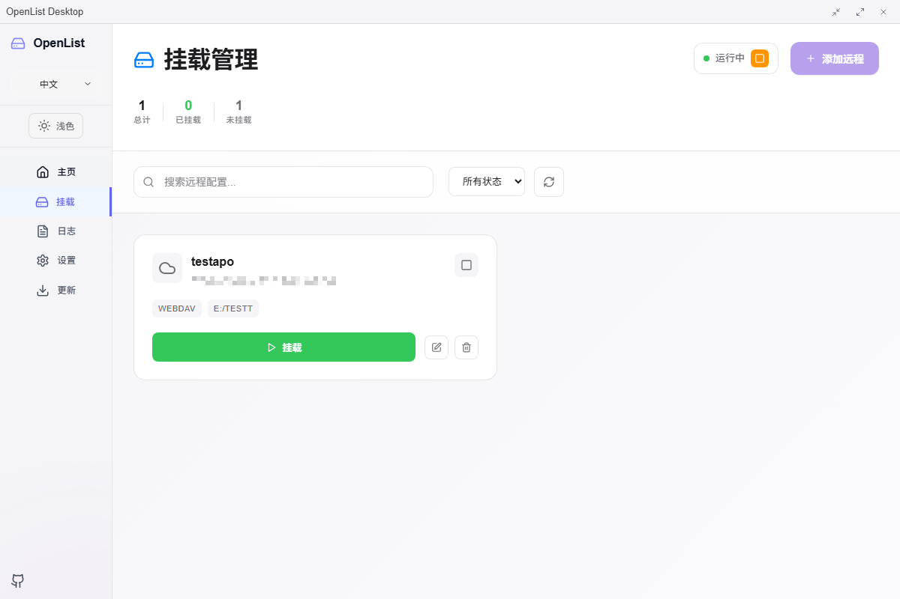

# OpenList Desktop

<div align="center">
  
  
  **跨平台的 OpenList 桌面应用程序，集成云存储功能**

  [](./LICENSE)
  [](https://vuejs.org/)
  [](https://tauri.app/)
  [](https://www.rust-lang.org/)
  
  [English](./README_en.md) | [中文](./README.md)
</div>

## 注意

该项目处于早期开发阶段，版本号0.x.x阶段，可能会有重大更改和不稳定的功能。

## 🔍 概述

OpenList Desktop 是一个功能强大的跨平台桌面应用程序，为管理 OpenList 服务和通过 Rclone 进行本地挂载提供用户友好的界面。

该应用程序是一个全面的解决方案，用于：

- 管理 OpenList 文件管理服务
- 挂载和管理云存储（WebDAV）
- 监控服务运行状态
- 提供系统托盘集成以进行后台操作

## ✨ 功能特性

### 🚀 核心功能

- **OpenList 服务管理**：启动、停止和监控 OpenList 核心服务
- **本地挂载**：通过 Rclone 挂载至本地文件系统
- **实时监控**：跟踪服务状态、运行时间和性能指标
- **进程管理**：具有自动重启功能的高级进程控制
- **系统托盘**：带系统托盘通知的后台操作

### ⚙️ 管理功能

- **服务控制**：启动/停止/重启 OpenList 和 Rclone 服务
- **配置管理**：所有服务的基于 GUI 的配置
- **日志监控**：实时日志查看和管理
- **更新管理**：自动更新检查和安装
- **自动启动**：配置应用程序与系统一起启动

## 📸 应用截图

### 主页仪表板


主仪表板提供您的 OpenList Desktop 环境的全面概览：

- OpenList 后台状态监控
- 常见任务的快速操作按钮
- OpenList和 Rclone 版本管理
- 服务管理控制

### 挂载管理



轻松进行本地挂载：

- 添加和配置存储远程
- 挂载/卸载云存储
- 监控挂载状态和统计信息
- 配置自动挂载选项

### 日志监控


跟踪系统操作：

- 实时日志流
- 按来源和级别过滤日志
- 导出和清除日志功能

### 设置配置


全面的设置管理：

- OpenList 核心配置
- 启动和自动化偏好设置
- 主题和语言选择

### 更新管理


保持最新版本：

- 下载和安装更新
- 版本历史和更新日志
- 自动更新计划

## 📦 安装

### 系统要求

- **操作系统**：Windows 10+、macOS 10.15+ 或 Linux（Ubuntu 18.04+）

### 下载选项

#### 1. GitHub 发布版（推荐）

从 [GitHub Releases](https://github.com/OpenListTeam/openlist-desktop/releases) 下载最新版本：

- **Windows**：`OpenList-Desktop_x.x.x_{arch}-setup.exe`
- **macOS**：`OpenList-Desktop_x.x.x_{arch}.dmg`
- **Linux**：`OpenList-Desktop_x.x.x_{arch}.deb` 或 `OpenList-Desktop_x.x.x_{arch}.rpm`

#### 2. 从源码构建

```bash
# 克隆仓库
git clone https://github.com/OpenListTeam/openlist-desktop.git
cd openlist-desktop

# 安装依赖
yarn install

# 准备开发环境
yarn run prebuild:dev

# 构建应用程序
yarn run build
yarn run tauri build
```

### 安装步骤

#### Windows

##### 使用安装程序

1. 下载 `.exe` 安装程序
2. 以管理员身份运行安装程序
3. 按照安装向导进行操作
4. 从开始菜单或桌面快捷方式启动

##### 使用Winget

```bash
winget install OpenListTeam.OpenListDesktop
```

#### macOS

1. 下载 `.dmg` 文件
2. 打开 DMG 并将 OpenList Desktop 拖到应用程序文件夹
3. 右键单击并选择"打开"（仅首次）
4. 在提示时授予必要权限

#### Linux

1. 下载 `.deb` 或 `.rpm` 包
2. 使用包管理器安装：

   ```bash
   sudo dpkg -i OpenList-Desktop_x.x.x_amd64.deb
   # 或者
   sudo rpm -i OpenList-Desktop_x.x.x_amd64.rpm
   ```

## 🚀 使用说明

### 首次启动

> **Note**: 建议在首次启动时通过管理员权限运行 OpenList Desktop，以确保正确安装和配置服务。

1. **初始设置**：首次启动时，应用程序将指导您完成初始配置
2. **服务安装**：在提示时安装 OpenList 服务
3. **存储配置**：配置您的第一个云存储连接

### 基本操作

#### 启动服务

```bash
仪表板 → 快速操作 → 启动 OpenList 核心
仪表板 → 快速操作 → 启动 Rclone 后端
```

#### 添加云存储

1. 导航到 **挂载** 选项卡
2. 点击 **添加远程** 按钮
3. 配置存储设置：
   - **名称**：存储的唯一标识符
   - **类型**：存储提供商（WebDAV）
   - **URL**：存储端点 URL
   - **凭据**：用户名和密码
   - **挂载点**：本地目录路径
4. 点击 **保存** 和 **挂载**

#### 监控操作

- **服务状态**：检查仪表板上的服务健康指示器
- **日志**：使用日志选项卡监控系统操作
- **性能**：在仪表板上查看运行时间和响应指标

### 高级功能

#### 自动挂载配置

```javascript
// 配置存储在启动时自动挂载
{
  "autoMount": true,
  "extraFlags": ["--vfs-cache-mode", "full"],
  "mountPoint": "/mnt/cloudstorage"
}
```

#### 自定义 Rclone 标志

添加自定义 Rclone 标志以获得最佳性能：

- `--vfs-cache-mode=full`：启用完整 VFS 缓存
- `--buffer-size=256M`：增加缓冲区大小
- `--transfers=10`：并发传输限制

#### 系统托盘操作

- **右键单击托盘图标** 进行快速操作
- **双击** 显示/隐藏主窗口

## ⚙️ 配置

### 应用程序设置

#### OpenList 服务配置

```json
{
  "openlist": {
    "port": 5244,
    "data_dir": "",
    "auto_launch": true,
    "ssl_enabled": false
  }
}
```

#### Rclone 配置

```json
{
  "rclone": {
    "config": {
      "mycloud": {
        "type": "webdav",
        "url": "https://cloud.example.com/dav",
        "user": "username",
        "pass": "encrypted-password",
        "mountPoint": "C:/CloudDrive",
        "autoMount": true,
        "extraFlags": ["--vfs-cache-mode", "full"]
      }
    },
  }
}
```

#### 应用程序偏好设置

```json
{
  "app": {
    "theme": "auto",
    "auto_update_enabled": true,
    "gh_proxy": "https://ghproxy.com/",
    "gh_proxy_api": false,
    "open_links_in_browser": true,
  }
}
```

## 🔧 开发

### 开发环境设置

#### 先决条件

- **Node.js**：v22+ 和 yarn
- **Rust**：最新稳定版本
- **Git**：版本控制

#### 设置步骤

```bash
# 克隆仓库
git clone https://github.com/OpenListTeam/openlist-desktop.git
cd openlist-desktop

# 安装 Node.js 依赖
yarn install

# 安装 Rust 依赖
cd src-tauri
cargo fetch

# 准备开发环境
cd ..
yarn run prebuild:dev

# 启动开发服务器
yarn run dev
```

#### 开发命令

```bash
# 启动带热重载的开发服务器
yarn run dev

# 启动不带文件监视的开发
yarn run nowatch

# 运行代码检查
yarn run lint

# 修复代码检查问题
yarn run lint:fix

# 类型检查
yarn run build --dry-run
```

#### 提交PR

```bash
git add .
yarn cz
```

## 🤝 贡献

我们欢迎社区贡献！

## 📄 许可证

本项目在 **GNU 通用公共许可证 v3.0** 下许可 - 详情请参见 [LICENSE](./LICENSE) 文件。

---

<div align="center">
  <p>由 OpenList 团队用 ❤️ 制作</p>
  <p>
    <a href="https://github.com/OpenListTeam/openlist-desktop">GitHub</a> •
    <a href="https://openlist.team">网站</a> •
    <a href="https://t.me/OpenListTeam">Telegram</a>
  </p>
</div>
