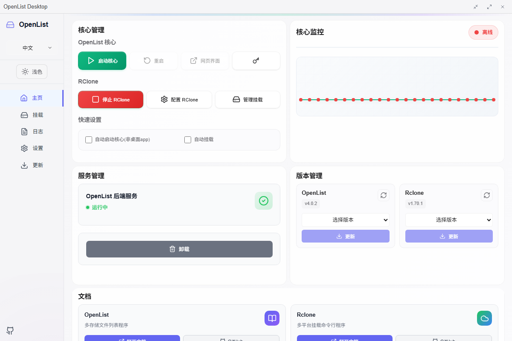
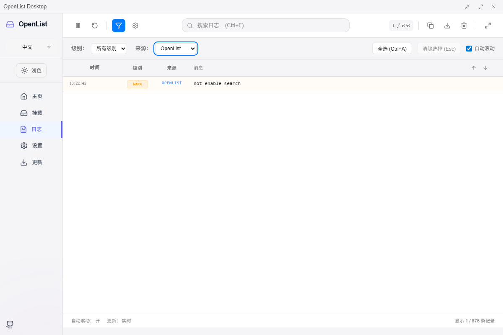
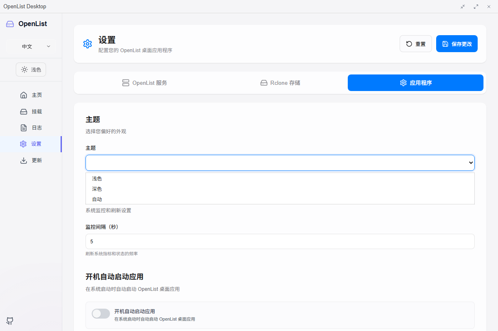
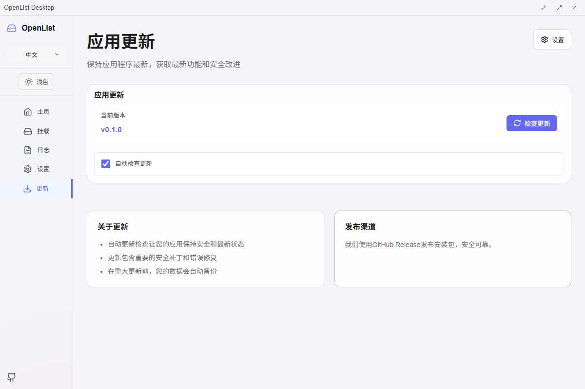

# OpenList Desktop

<div align="center">
  
  
  **A cross-platform desktop application for OpenList with cloud storage integration**

  [](./LICENSE)
  [](https://vuejs.org/)
  [](https://tauri.app/)
  [](https://www.rust-lang.org/)
  
  [English](./README.md) | [中文](./README_zh.md)
</div>

## Attention

This project is in the early development stage, with a version number of 0.x.x. There may be significant changes and unstable features.

## 🔍 Overview

OpenList Desktop is a powerful cross-platform desktop application that provides a user-friendly interface for managing OpenList services and performing local mounts via Rclone.

The application serves as a comprehensive solution for:

- Managing OpenList file management services
- Mounting and managing cloud storage (WebDAV)
- Monitoring service status and uptime
- Providing system tray integration for background operations

## ✨ Features

### 🚀 Core Features

- **OpenList Service Management**: Start, stop, and monitor OpenList core services
- **Local Mounting**: Mount via Rclone to the local file system
- **Real-time Monitoring**: Track service status, uptime, and performance metrics
- **Process Management**: Advanced process control with auto-restart capabilities
- **System Tray**: Background operation with system tray notifications

### ⚙️ Management Features

- **Service Control**: Start/stop/restart OpenList and Rclone services
- **Configuration Management**: GUI-based configuration for all services
- **Log Monitoring**: Real-time log viewing and management
- **Update Management**: Automatic update checking and installation
- **Auto-startup**: Configure applications to start with system boot

## 📸 Screenshots

### Home Dashboard



The main dashboard provides a comprehensive overview of your OpenList Desktop environment with:

- OpenList backend status monitoring
- Quick action buttons for common tasks
- OpenList and Rclone version management
- Service management controls

### Mount Management


Easily perform local mounts:

- Add and configure storage remotes
- Mount/unmount cloud storage
- Monitor mount status and statistics
- Configure auto-mounting options

### Log Monitoring



Keep track of system operations:

- Real-time log streaming
- Filter logs by source and level
- Export and clear log functionality

### Settings Configuration



Comprehensive settings management:

- OpenList core configuration
- Startup and automation preferences
- Theme and language selection

### Update Management



Stay up-to-date with the latest versions:

- Download and install updates
- Version history and changelog
- Automatic update scheduling

## 📦 Installation

### Prerequisites

- **Operating System**: Windows 10+, macOS 10.15+, or Linux (Ubuntu 18.04+)

### Download Options

#### 1. GitHub Releases (Recommended)

Download the latest release from [GitHub Releases](https://github.com/OpenListTeam/openlist-desktop/releases):

- **Windows**：`OpenList-Desktop_x.x.x_{arch}-setup.exe`
- **macOS**：`OpenList-Desktop_x.x.x_{arch}.dmg`
- **Linux**：`OpenList-Desktop_x.x.x_{arch}.deb` or `OpenList-Desktop_x.x.x_{arch}.rpm`

#### 2. Build from Source

```bash
# Clone the repository
git clone https://github.com/OpenListTeam/openlist-desktop.git
cd openlist-desktop

# Install dependencies
yarn install

# Prepare development environment
yarn run prebuild:dev

# Build the application
yarn run build
yarn run tauri build
```

### Installation Steps

#### Windows

##### Installation via Installer

1. Download the `.exe` installer
2. Run the installer as Administrator
3. Follow the installation wizard
4. Launch from Start Menu or Desktop shortcut

##### Winget

```bash
winget install OpenListTeam.OpenListDesktop
```

#### macOS

1. Download the `.dmg` file
2. Open the DMG and drag OpenList Desktop to Applications
3. Right-click and select "Open" (first time only)
4. Grant necessary permissions when prompted

#### Linux

1. Download the `.deb` or `.rpm` package
2. Use your package manager to install:

   ```bash
   sudo dpkg -i OpenList-Desktop_x.x.x_amd64.deb
   # or
   sudo rpm -i OpenList-Desktop_x.x.x_amd64.rpm
   ```

## 🚀 Usage

### First Launch

> **Note**: It is recommended to run OpenList Desktop with Administrator privileges on first launch to ensure proper service installation and configuration.

1. **Initial Setup**: On first launch, the application will guide you through initial configuration
2. **Service Installation**: Install the OpenList service when prompted
3. **Storage Configuration**: Configure your first cloud storage connection
4. **Tutorial**: Complete the interactive tutorial to learn key features

### Basic Operations

#### Starting Services

```bash
Dashboard → Quick Actions → Start OpenList Core
Dashboard → Quick Actions → Start Rclone Backend
```

#### Adding Cloud Storage

1. Navigate to **Mount** tab
2. Click **Add Remote** button
3. Configure storage settings:
   - **Name**: Unique identifier for your storage
   - **Type**: Storage provider (WebDAV)
   - **URL**: Storage endpoint URL
   - **Credentials**: Username and password
   - **Mount Point**: Local directory path
4. Click **Save** and **Mount**

#### Monitoring Operations

- **Service Status**: Check the dashboard for service health indicators
- **Logs**: Use the Logs tab to monitor system operations
- **Performance**: View uptime and response metrics on the dashboard

### Advanced Features

#### Auto-mounting Configuration

```javascript
// Configure storage to mount automatically on startup
{
  "autoMount": true,
  "extraFlags": ["--vfs-cache-mode", "full"],
  "mountPoint": "/mnt/cloudstorage"
}
```

#### Custom Rclone Flags

Add custom Rclone flags for optimal performance:

- `--vfs-cache-mode=full`: Enable full VFS caching
- `--buffer-size=256M`: Increase buffer size
- `--transfers=10`: Concurrent transfer limit

#### System Tray Operations

- **Right-click tray icon** for quick actions
- **Double-click** to show/hide main window

## ⚙️ Configuration

### Application Settings

#### OpenList Service Configuration

```json
{
  "openlist": {
    "port": 5244,
    "api_token": "your-secure-token",
    "auto_launch": true,
    "ssl_enabled": false
  }
}
```

#### Rclone Configuration

```json
{
  "rclone": {
    "config": {
      "mycloud": {
        "type": "webdav",
        "url": "https://cloud.example.com/dav",
        "user": "username",
        "pass": "encrypted-password",
        "mountPoint": "C:/CloudDrive",
        "autoMount": true,
        "extraFlags": ["--vfs-cache-mode", "full"]
      }
    },
  }
}
```

#### Application Preferences

```json
{
  "app": {
    "theme": "auto",
    "auto_update_enabled": true,
    "gh_proxy": "https://ghproxy.com/",
    "gh_proxy_api": false,
    "open_links_in_browser": true,
  }
}
```

### Environment Variables

- `OPENLIST_API_TOKEN`: Override default API token
- `OPENLIST_PORT`: Override default port (5244)
- `RCLONE_CONFIG_DIR`: Custom Rclone configuration directory
- `LOG_LEVEL`: Set logging level (debug, info, warn, error)

## 🔧 Development

### Development Environment Setup

#### Prerequisites

- **Node.js**: v22+ with yarn
- **Rust**: Latest stable version
- **Git**: Version control

#### Setup Steps

```bash
# Clone repository
git clone https://github.com/OpenListTeam/openlist-desktop.git
cd openlist-desktop

# Install Node.js dependencies
yarn install

# Install Rust dependencies
cd src-tauri
cargo fetch

# Prepare development environment
cd ..
yarn run prebuild:dev

# Start development server
yarn run dev
```

#### Development Commands

```bash
# Start development server with hot reload
yarn run dev

# Start development without file watching
yarn run nowatch

# Run linting
yarn run lint

# Fix linting issues
yarn run lint:fix

# Type checking
yarn run build --dry-run
```

## 🤝 Contributing

We welcome contributions from the community!

## 📄 License

This project is licensed under the **GNU General Public License v3.0** - see the [LICENSE](./LICENSE) file for details.

---

<div align="center">
  <p>Made with ❤️ by the OpenList Team</p>
  <p>
    <a href="https://github.com/OpenListTeam/openlist-desktop">GitHub</a> •
    <a href="https://openlist.team">Website</a> •
    <a href="https://t.me/OpenListTeam">Telegram</a>
  </p>
</div>
